# Build Guide

This guide covers the mechanical structure, waterproof enclosures,
electronics wiring, and plumbing for the FiSH 80W Kit. It documents the
prototype exactly as it was built for the *An Ocean City Imagined*
residency (Aug–Sep 2024, Singapore) — including the parts of it that
didn't work well, which are called out inline and expanded on in
[`FUTURE_WORK.md`](FUTURE_WORK.md).

> **Safety first:** read [`README.md#safety`](README.md#safety) before
> starting. This build involves hydrogen gas, mains-adjacent battery
> wiring, and power tools.

## 1. The steel frame

> **Unit note:** the original build notes give two different cut lists —
> an imperial one in the parts list and a metric one in these
> instructions. Both are reproduced below (unchanged from the source
> documentation) so you can cross-check against your own design; the
> instructions below follow the metric figures actually used to describe
> assembly.

**Imperial cut list** (Slotted Steel Angle Bar, 1.5" × 1.5" × 1/16", 73,000 mm total):
7× 44", 10× 32", 4× 14", 2× 4".

**Metric cut list** (as used in the steps below): 8× 810 mm, 6× 1120 mm, 2× 100 mm.

1. Cut the steel angle bars to the measurements above.
2. Bolt the end of a 100 mm bar perpendicular to the end of an 810 mm bar.
3. Bolt another 810 mm bar to the first two to form a right-angled triangle.
   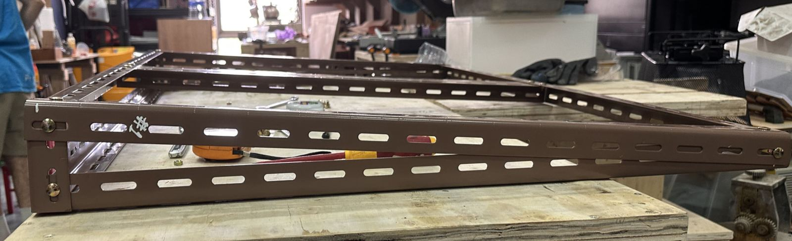
4. Repeat steps 2–3 to make a mirrored triangle.
5. Join the two triangles with an 1120 mm bar at the top and bottom of the two 100 mm bars.
6. Bolt another 1120 mm bar to the ends of the triangles.
7. At the centre of the 1120 mm bars, bolt two 810 mm bars across, as shown:
   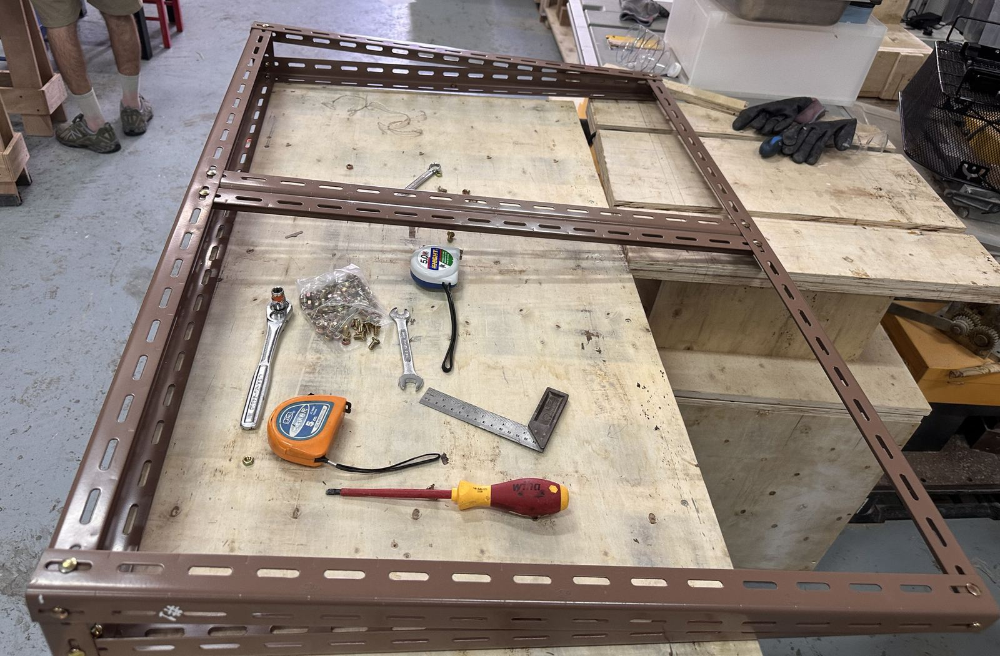
8. To form the rectangular base of the frame, bolt 2× 1120 mm bars to 2× 810 mm bars.
9. From each corner of the base, bolt 4× 314 mm bars vertically upward.
10. Bolt 2× 810 mm and 2× 1120 mm bars across the tops of the 314 mm bars to close the rectangular box:
    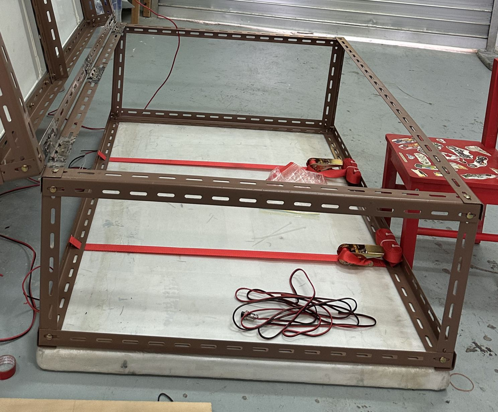
11. Mark and place 3 steel mortise hinges along one of the top 1120 mm bars.
12. Line up the triangle structure on top of the rectangular structure and mark the hinge positions.
13. Sand and clean the marked areas.
14. Weld the first hinge to the rectangular structure, then to the corresponding point on the triangle structure.
15. Repeat step 14 for the remaining two hinges.

## 2. Solar panel mounting

1. Place the solar panels on the triangle structure and mark the mounting-hole positions.
   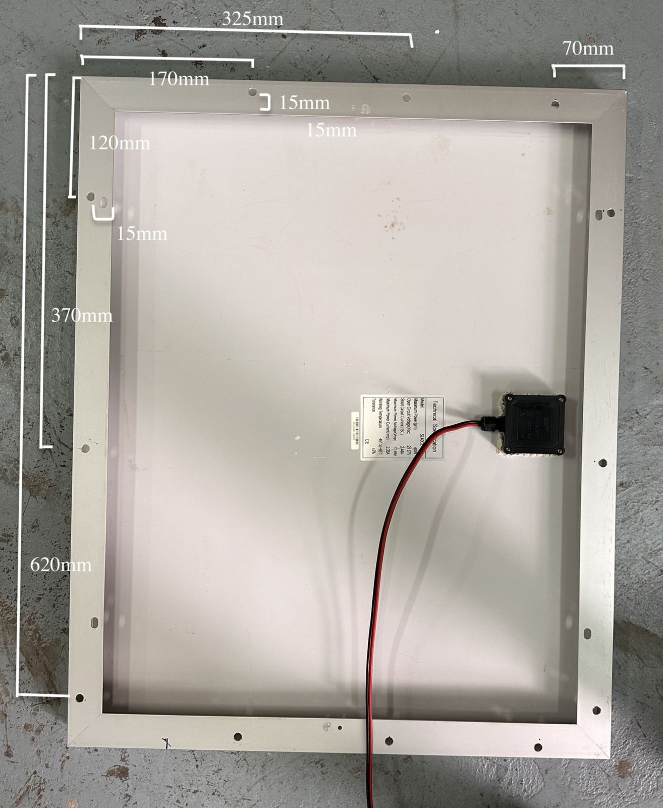
2. Drill a 6 mm hole at each marked point.
3. Bolt the panels to the top of the steel structure.
4. Repeat for the second panel:
   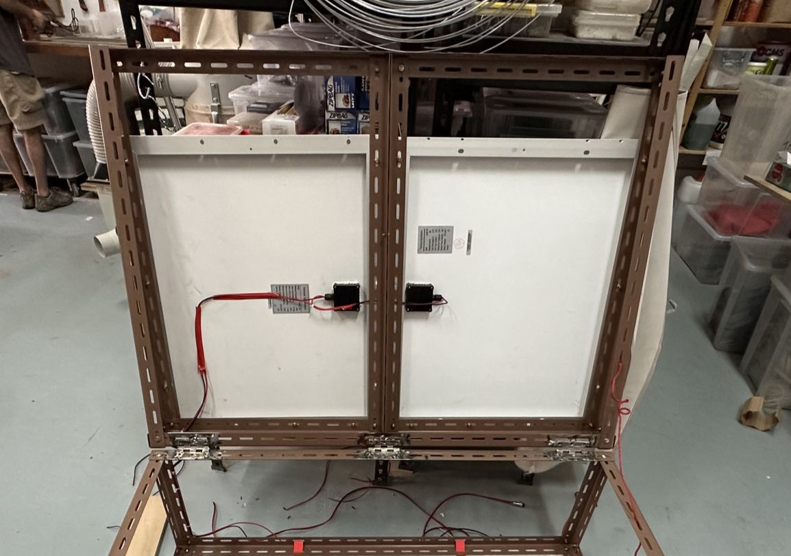

## 3. Floating foam board

1. Join the lengths of two foam boards with expanding gun foam.
2. Clamp the sides together while the foam cures; leave to dry completely.
3. Trim the dry excess foam with a box cutter.
4. Cut the foam to 815 × 1115 × 55 mm.
5. Sand the foam board.
6. Cover the foam with paper using the PVA/water glue mixture.
7. Leave to dry completely; fill any gaps with more of the glue mixture.
8. Cover the board with fibreglass using the resin/hardener mixture.
9. Leave to fully cure, then sand smooth.
10. Secure the foam board to the underside of the steel structure with 2 compression belts.

**End result:**

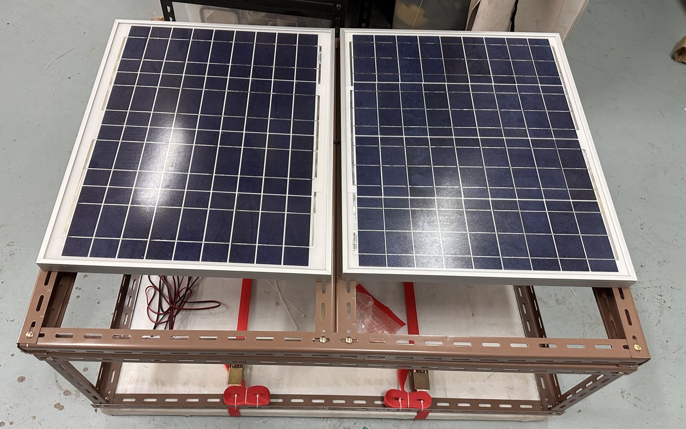
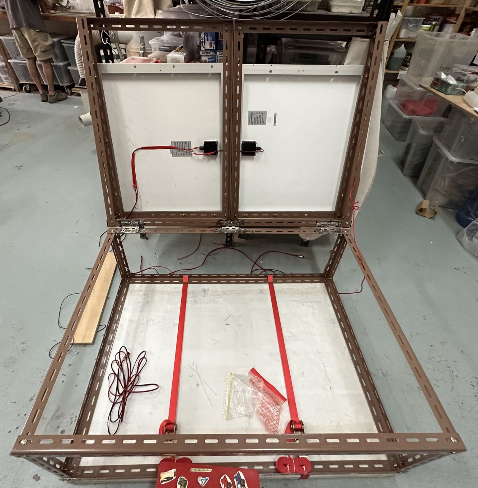
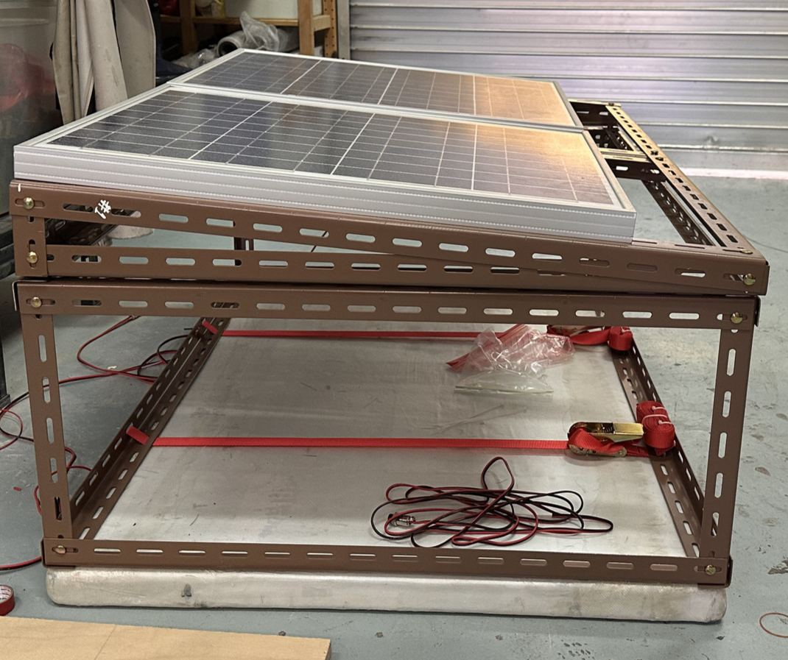

## 4. Waterproof enclosures

Three small PP boxes (e.g. IKEA SAMLA) hold the electrolysers, the water
tank, and the electronics; a larger PP box is the outer waterproof shell.
See [`bom/BOM.md`](bom/BOM.md) for exact box sizes as recorded.

### Electrolyser box

1. Drill two 6 mm holes, one above the other, on each side of the box (for pipes).
2. Drill two 6 mm holes on the front of the box (for pipes).
3. On the opposite side from step 2, drill two smaller holes (for wires).

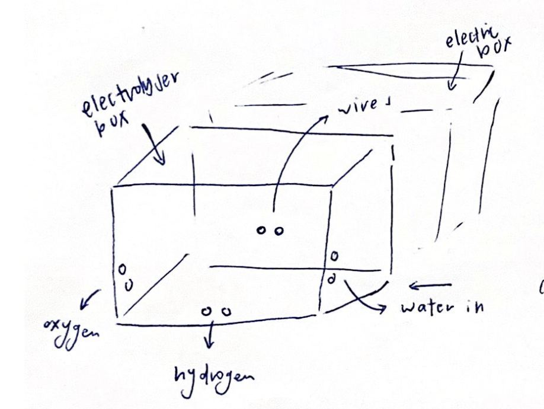

### Water tank

1. Drill a 6 mm hole at one front corner of the tank.
2. Drill a 7 mm hole at the opposite front corner.
3. On the side adjacent to the 7 mm hole, cut a hole large enough for a USB cable.

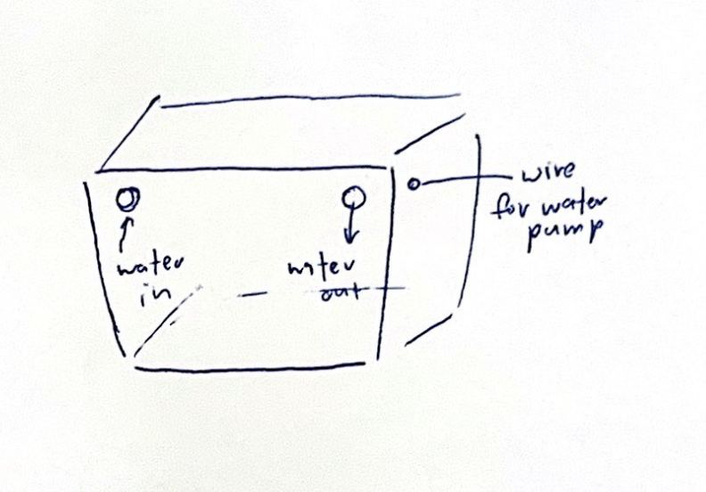

### Electronics box

1. Drill two small holes next to each other on the back of the box (for wires).
2. Drill a hole the size of the voltmeter face on the side.
3. Cut a hole the size of a USB connector on the same side.
4. On the same face, cut a hole the size of the switch face.
5. On the same face, drill a hole large enough for a wire connector.

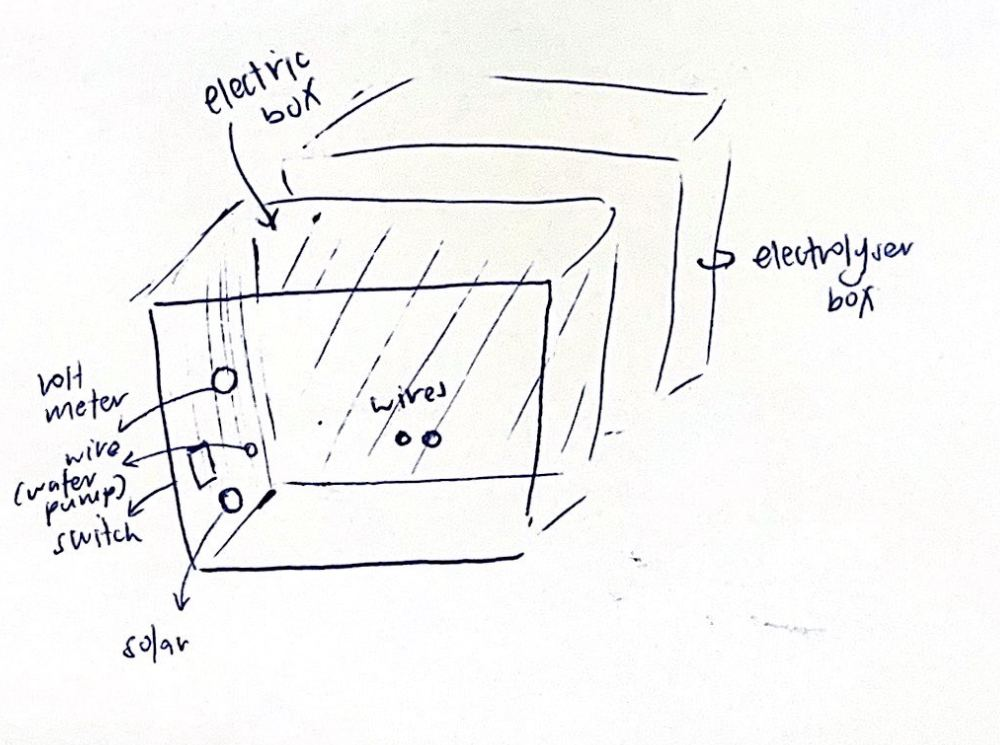

## 5. Electronics wiring

1. Connect the solar panels in series, through the electronics box, to the solar charge controller.
2. Connect the charge controller to the 12 V battery.
3. Connect the charge controller to the step-down converter.
4. Set the step-down converter output to **7 V / 14 A**.
5. Connect the two electrolysers in series.
6. Connect the step-down converter, switch, and the two electrolysers in series.
7. Route the water pump wire through the USB hole in the water tank and into the electronics box.
8. Connect the water pump to the USB port on the solar charge controller.
9. Connect the FiSH DataLogger board (or a plain voltmeter) in parallel with the solar panels.
10. Connect the FiSH DataLogger board (or a plain voltmeter) in parallel with the electrolysers.

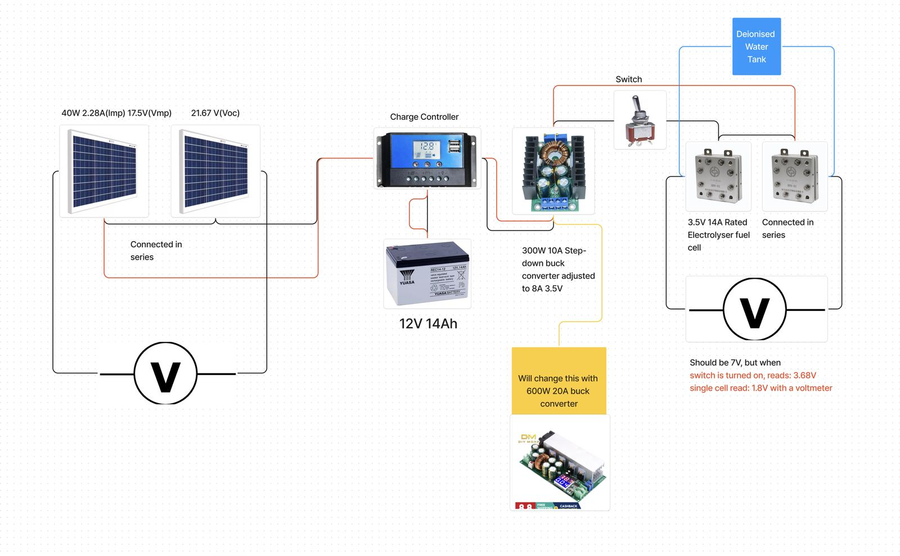

For the DataLogger circuit itself (schematic, PCB, and firmware), see
[`hardware/pcb/`](hardware/pcb/) and [`firmware/`](firmware/).

## 6. Electrolysis plumbing

1. Submerge the water pump in the water tank.
2. Route a pipe from the top of the water tank to the water filter.
3. Connect the filter outlet to a 'Y' pipe connector.
4. Route two pipes from the other side of the 'Y' through the two side holes in the electrolyser box.
5. Connect those two pipes to the "water in" port of each electrolyser.
6. Route the anode (oxygen) outlet of each electrolyser through another pair of holes in the electrolyser box.
7. Connect the oxygen pipe to the top of the air–gas separator.
8. Route the cathode (hydrogen) outlets of both electrolysers through another set of holes to a second 'Y' connector.
9. Connect that 'Y' connector to the air–gas separator.
10. Connect the top of the air–gas separator to the hydrogen collection point.
11. Connect the bottom of the air–gas separator back to the water tank, recycling excess water.

> **Known issue:** the PVC/silicone tubing used in this build is highly
> permeable to hydrogen and accounts for an estimated ~58% gas loss (see
> [`TESTING.md`](TESTING.md)). [`FUTURE_WORK.md`](FUTURE_WORK.md)
> recommends switching to polyethylene (PE) tubing and hydrogen-rated
> push-to-connect fittings.

## Reference photos

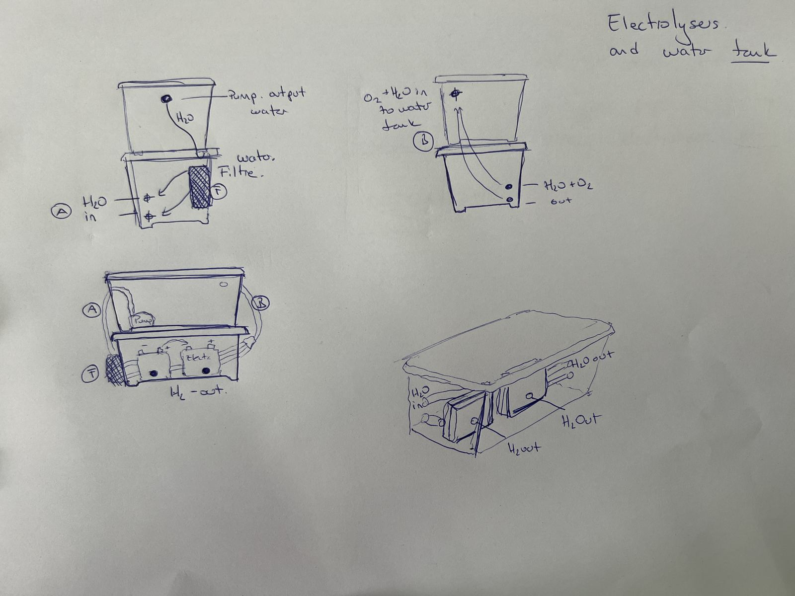
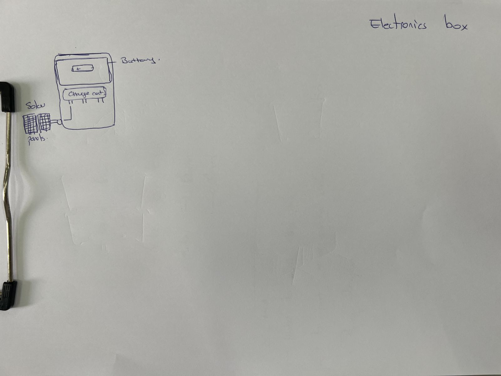
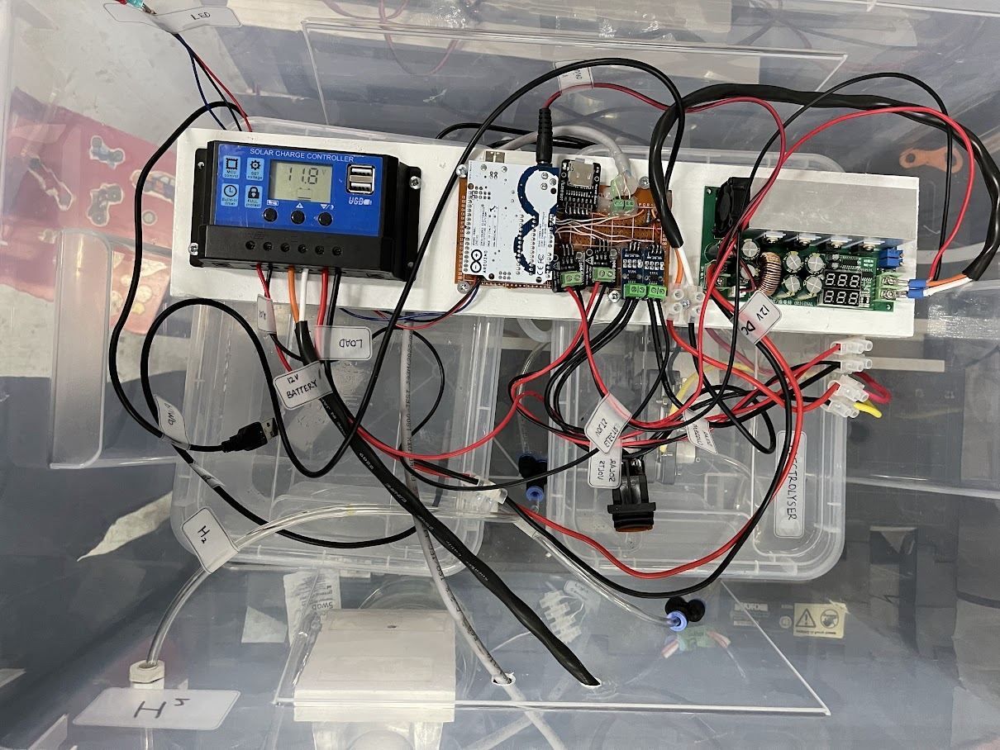
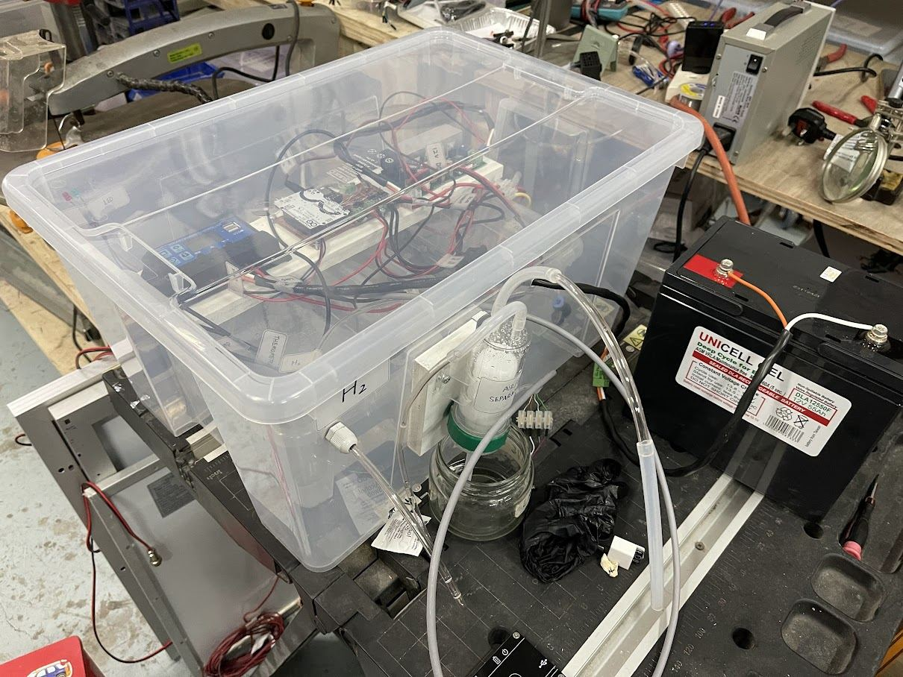
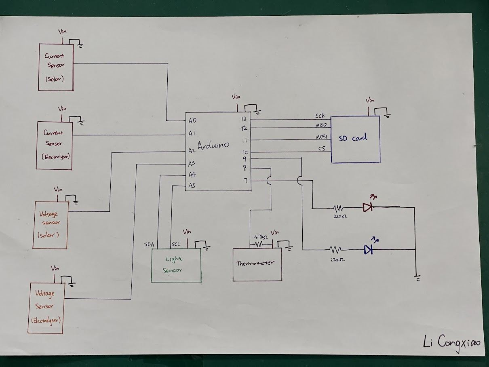

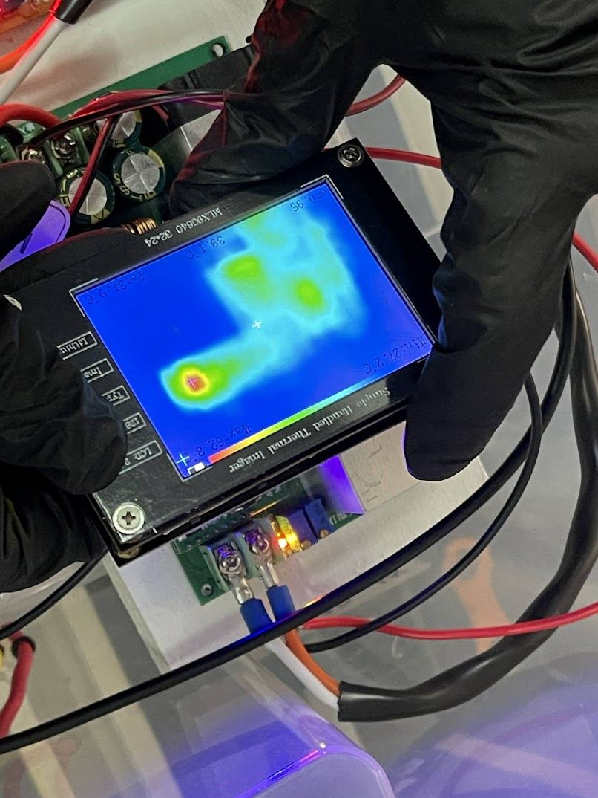

The step-down transformer's diodes ran up to ~100°C in testing — plan for
a heatsink or a different converter topology; see
[`FUTURE_WORK.md`](FUTURE_WORK.md).
