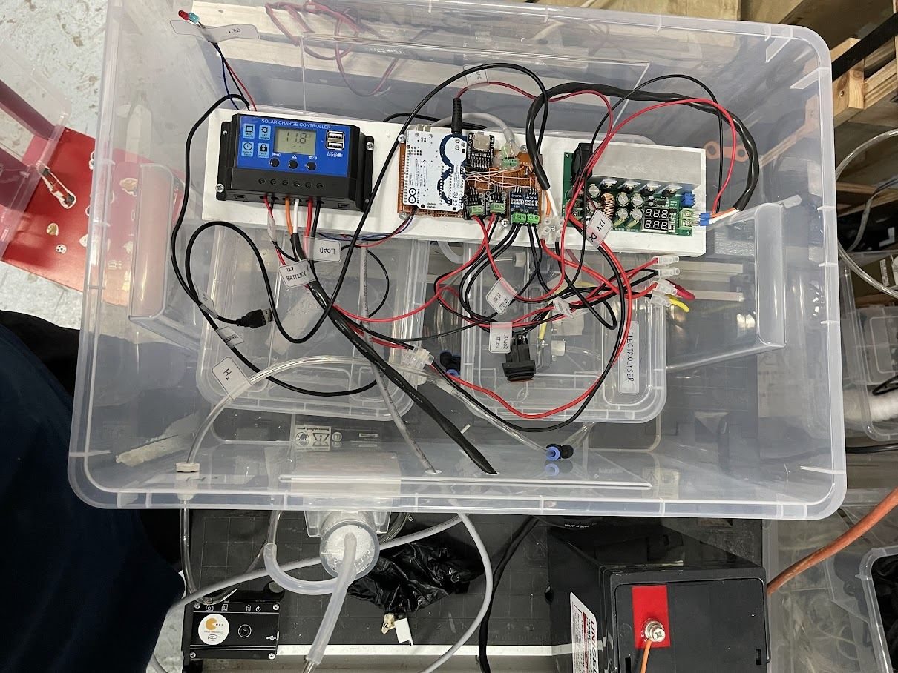
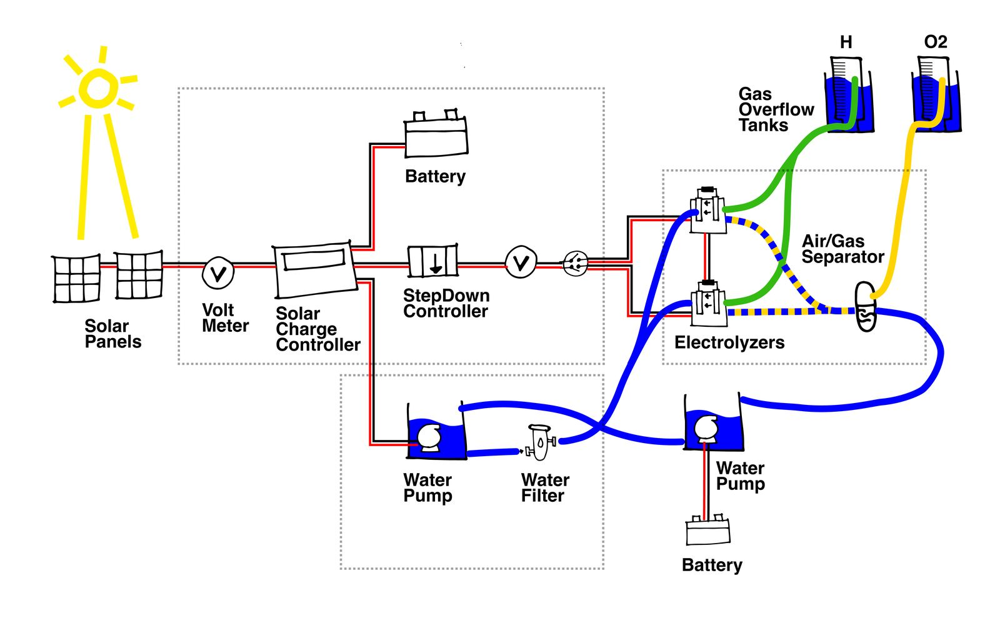
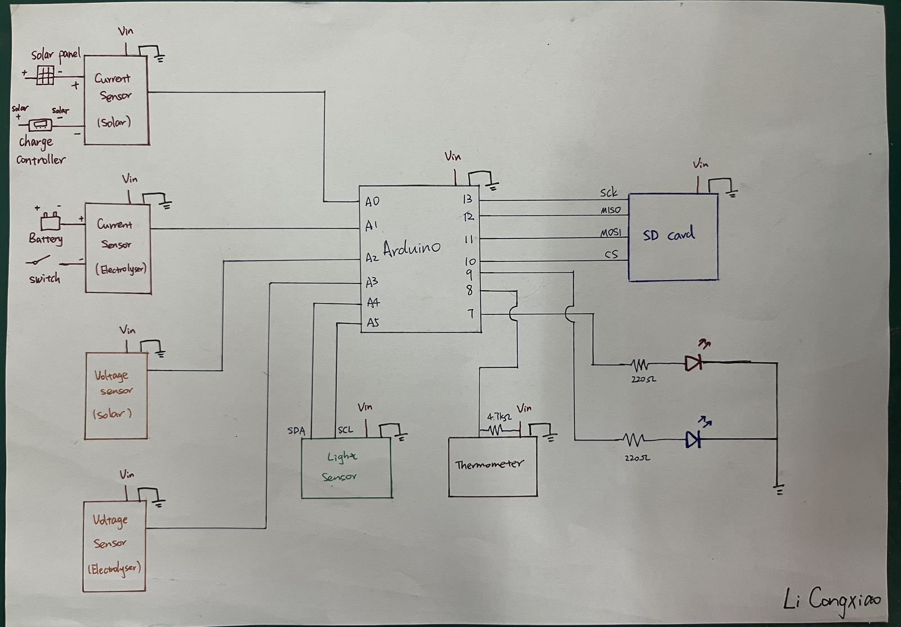

# FiSH — Floating Solar Hydrogen Prototype (80 W Kit)
<!--
  README.md
  Part of the Floating Solar Hydrogen Data Center open-hardware project — see ../README.md
  License: CERN-OHL-S v2 (hardware), see ../License.md
-->

<div align="center">

### A fully instrumented, self-contained floating solar → hydrogen prototype

[](../License.md)
[](#quick-facts)
[](TESTING.md)

<sub>Prototype "f" in the Floating Solar Hydrogen Data Center's six-prototype history — see <a href="../README.md#4-past-prototypes">the main repository README</a>.</sub>



</div>

---

## At a glance

FiSH ("Floating Solar Hydrogen") is a small, self-contained floating
platform that generates electricity from two 40 W solar panels, uses it
to electrolyse water into hydrogen and oxygen through two PEM
electrolysers, and logs solar/electrolyser voltage, current, ambient
light, and water temperature to an SD card via a custom Arduino
"FiSH DataLogger" shield.

It was built and tested in Singapore between August and September 2024
as part of the *"Cesar Jung-Harada: An Ocean City Imagined"* residency at
the ArtScience Museum, and is documented here so others can build,
critique, and improve on it — floating hydrogen production, tested in a
lab, on land, and on open water.

This folder is named for the array size — **2 × 40 W = 80 W** — following
the naming convention used elsewhere in this repository (see the
`10 kW Kit` and `100W Kit` folders at the repository root).

## Quick facts

| | |
| --- | --- |
| Solar array | 2 × 40 W polycrystalline panels = **80 W** |
| Electrolysers | 2 × PEM, 14 A / 3.5 V, ~100 mL H₂/min rated each |
| Measured hydrogen output (water test, with losses) | ~2873 mL/h |
| Estimated hydrogen leakage | ~58% (see [`TESTING.md`](TESTING.md)) |
| Sensing / logging | Custom Arduino Uno-based "FiSH DataLogger" shield, SD card |
| Location / dates | Singapore, tested 7–13 Aug 2024; residency Sep–Oct 2024 |
| Total DataLogger electronics BOM | ~SGD 68.53 (indicative, see [`bom/BOM.md`](bom/BOM.md)) |
| Hardware licence | CERN-OHL-S v2 — see [`../License.md`](../License.md) |

## Team & credits

**Design and engineering:** Li Congxiao, Kaitlyn Tan, Doruk Tan Ozturk,
Mitalee Parikh, Saad Chinoy — under the direction of Cesar Harada.

**Supporting institutions and collaborators:** ArtScience Museum
(Singapore), Constance Gaume, Huey Lin & Frederic Gaume, the Singapore
Institute of Technology, and Conservatoire National des Arts et Métiers
(CNAM), Paris.

This prototype is credited as entry **f** ("2024 Sep · Singapore ·
*Floating Solar Hydrogen*") in the project's
[full prototype history and acknowledgements](../README.md#4-past-prototypes).
If you build on this design, please keep this credit line — see
[Collaboration norms](../README.md#123-collaboration-norms) in the main
repository README.

## Folder map

```text
80W Kit/
├── README.md            ← you are here
├── BUILD_GUIDE.md        ← frame, floats, enclosures, wiring, plumbing
├── TESTING.md            ← test protocol, results, and discussion
├── FUTURE_WORK.md        ← known issues, fixes, and the FSH003–FSH006 roadmap
├── bom/
│   ├── BOM.md            ← cleaned-up bill of materials
│   └── raw-export/       ← original Octopart distributor CSV exports
├── firmware/              ← Arduino sketches (standalone sensor tests + integrated logger)
├── hardware/
│   ├── pcb/               ← FiSH-GenShield Gerbers + board photos
│   └── diagrams/          ← system diagram (source .ai + rendered), circuit images
├── images/                ← build, prototype, sensor, testing, and reference photos
├── media/                 ← test videos (.mov)
└── testing/data/          ← raw test-result CSVs
```

## System overview

Solar energy is converted to electricity by the two panels, regulated
through a solar charge controller into a 12 V battery, then stepped down
to ~7 V to drive two PEM electrolysers in series. Electrolysis splits
deionised water into hydrogen (cathode) and oxygen (anode); a
water/air-gas separator keeps the collected hydrogen dry and recycles
excess water back to the tank. The whole assembly floats on a fibreglass-
skinned foam board bolted to a welded steel angle-bar frame, inside
waterproof PP enclosures.



The source Illustrator file is at
[`hardware/diagrams/system-diagram.ai`](hardware/diagrams/system-diagram.ai).

## Documentation index

| Section | What's there |
| --- | --- |
| [`BUILD_GUIDE.md`](BUILD_GUIDE.md) | Step-by-step build: steel frame, solar mounting, floating foam board, waterproof enclosures, electronics wiring, electrolysis plumbing |
| [`bom/BOM.md`](bom/BOM.md) | Full parts list — structure/solar/hydrogen system and DataLogger electronics |
| [`hardware/pcb/`](hardware/pcb/) | Gerber files and photos for the custom "FiSH-GenShield" PCB |
| [`firmware/`](firmware/) | Arduino sketches: per-sensor tests plus the integrated DataLogger |
| [`TESTING.md`](TESTING.md) | Lab, land, water, and DataLogger test protocols, results, and discussion |
| [`FUTURE_WORK.md`](FUTURE_WORK.md) | Known issues (leakage, balance, power delivery), recommended fixes, and the roadmap sketched for FSH003–FSH006 |

## Sensor suite

| Sensor | Measures | Interface |
| --- | --- | --- |
| ACS712 (×2) | Solar current, electrolyser current | Analog |
| Resistive divider module (×2) | Solar voltage, electrolyser voltage (0–25 V) | Analog |
| BH1750FVI | Ambient light (solar illuminance) | I2C |
| DS18B20 (waterproof) | Water temperature into the electrolyser | 1-Wire |
| YwRobot microSD module | On-board data logging | SPI |



Details, wiring, and code for each sensor are in [`firmware/`](firmware/).

## Safety

This is a hydrogen-producing device with exposed battery power. Read
this before building or operating a copy:

- **Hydrogen is flammable and leak-prone.** This prototype measured
  ~58% hydrogen leakage through its tubing and fittings (see
  [`TESTING.md`](TESTING.md)); assume any build will leak some hydrogen
  and operate it in a well-ventilated area, away from ignition sources,
  until you have characterised your own leak rate.
- **No pressurised storage was used in this prototype** — hydrogen was
  captured at ambient (low) pressure only. Do not adapt this design to
  pressurised storage without a full re-assessment of materials and
  fittings for hydrogen service.
- **Electrical:** the 12 V battery and step-down converter can source
  significant current (the electrolysers alone draw ~14 A); use
  appropriately rated wiring, fusing, and a clearly accessible on/off
  switch. The step-down converter in this prototype ran hot (~100°C at
  its diodes, see [`BUILD_GUIDE.md`](BUILD_GUIDE.md#reference-photos)) —
  heatsink or derate accordingly.
- **Marine/mechanical:** the device is not ballast-stable — see the
  balance issue in [`FUTURE_WORK.md`](FUTURE_WORK.md). Do not open the
  hatch while the device is afloat.
- This document does not replace local hydrogen, electrical, or marine
  safety regulation in your jurisdiction. See also
  [§D Safety](../README.md#d-safety) in the main repository README.

## Media

- Test videos: [`media/fish-prototype-test-video-1.mov`](media/fish-prototype-test-video-1.mov), [`media/fish-prototype-test-video-2.mov`](media/fish-prototype-test-video-2.mov)
- Full photo album: [Google Photos — "FloatingSolarHydrogen 'FiSH'"](https://photos.app.goo.gl/MF1NY26gttw1StrU9)
- Water test clip referenced in the original test log: https://www.youtube.com/watch?v=3NeedoGKK9c

## Citation

If you build on or reference this specific prototype, please cite it as
entry **f** in the project's main citation (see
[`../README.md#citation`](../README.md#citation)), and note the folder
path (`80W Kit/`) for traceability, per
[`../README.md#citation`](../README.md#citation).

## License

This folder is part of the **Floating Solar Hydrogen Data Center**
repository and is covered by that repository's existing licensing —
**hardware under CERN-OHL-S v2**, see [`../License.md`](../License.md);
documentation and diagrams under CC BY-SA 4.0 unless otherwise marked,
per [`../README.md#license`](../README.md#license). No separate licence
terms are introduced by this folder.
