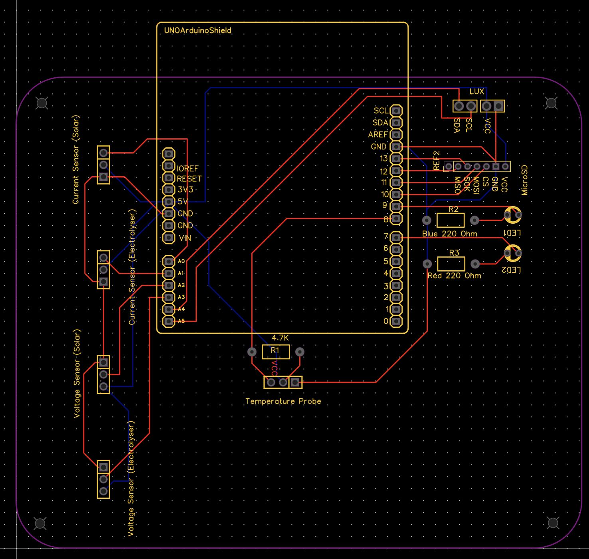
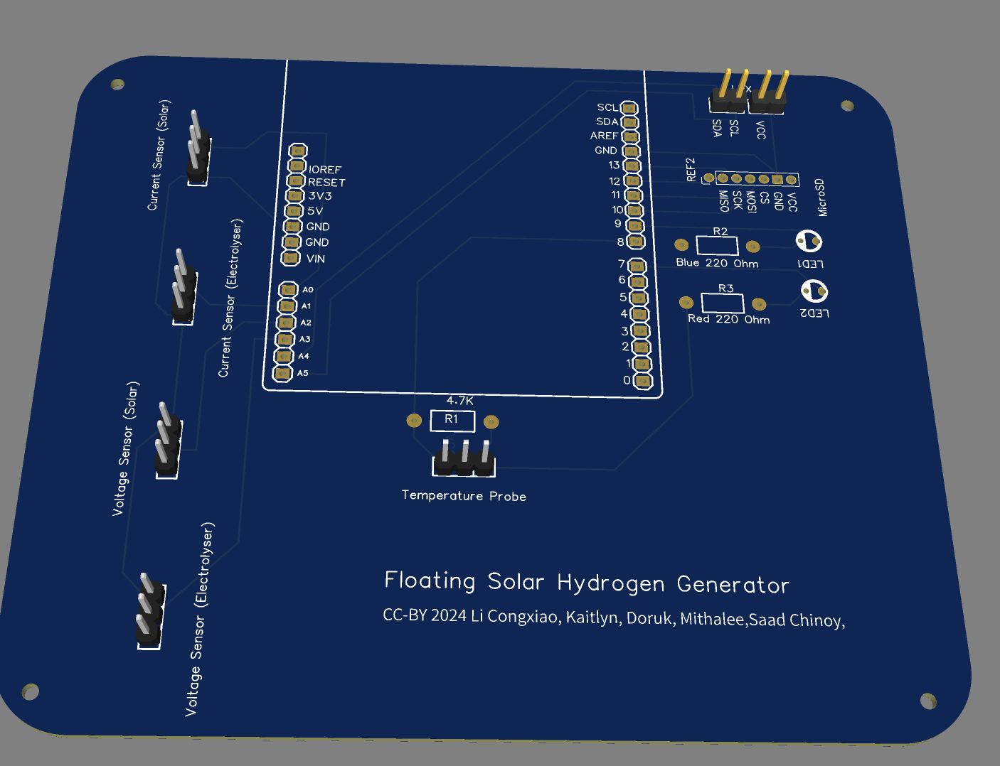

# FiSH-GenShield PCB

Custom Arduino shield ("FiSH-GenShield") that the FiSH DataLogger
firmware ([`../../firmware/`](../../firmware/)) runs on — breaks out the
current/voltage sensor inputs, I2C, 1-Wire, and microSD card slot
described in [`../../firmware/README.md`](../../firmware/README.md).

## Files

- [`Gerber_FiSH-Gen_PCB_FiSH-GenShield_2024-09-04.zip`](Gerber_FiSH-Gen_PCB_FiSH-GenShield_2024-09-04.zip) —
  original fabrication-ready Gerber/drill package (upload this zip
  directly to a PCB fab such as JLCPCB or PCBWay).
- [`gerbers/`](gerbers/) — the same files extracted, for browsing
  individual layers or opening in a Gerber viewer (e.g. KiCad's Gerber
  viewer, or [gerber-viewer](https://www.gerber-viewer.com/)):

  | File | Layer |
  | --- | --- |
  | `Gerber_TopLayer.GTL` | Top copper |
  | `Gerber_BottomLayer.GBL` | Bottom copper |
  | `Gerber_TopSilkscreenLayer.GTO` | Top silkscreen |
  | `Gerber_TopSolderMaskLayer.GTS` | Top solder mask |
  | `Gerber_BottomSolderMaskLayer.GBS` | Bottom solder mask |
  | `Gerber_BoardOutlineLayer.GKO` | Board outline (mechanical) |
  | `Gerber_MechanicalLayer.GME` | Mechanical / keep-out |
  | `Gerber_DocumentLayer.GDL` | Documentation |
  | `Drill_PTH_Through.DRL` | Plated through-hole drills |
  | `Drill_PTH_Through_Via.DRL` | Plated through-hole vias |
  | `Drill_NPTH_Through.DRL` | Non-plated through-hole drills |
  | `How-to-order-PCB.txt` | Fab ordering notes from the original designer |

## Ordering

See [`gerbers/How-to-order-PCB.txt`](gerbers/How-to-order-PCB.txt) and
EasyEDA's guide: https://docs.easyeda.com/en/PCB/Order-PCB

## Native design source

The native PCB design-tool project file (e.g. EasyEDA/KiCad source) was
not included in the original project export — only the fabrication
Gerbers above. If you have access to the original design file, please
contribute it back per [`../../CONTRIBUTING`](../../README.md#how-to-contribute)
guidance in the main repository.
