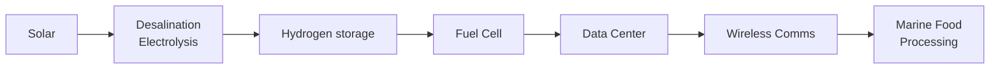
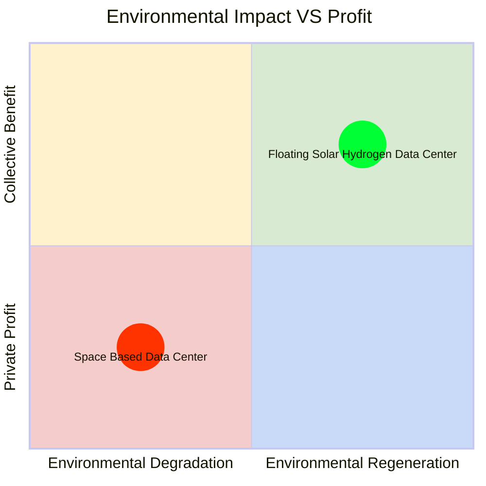

# Floating Solar Hydrogen Data Center
<!--
  README.md — version 4
  Project: Floating Solar Hydrogen Data Center
  Author : Cesar Harada — contact@cesarharada.com
  License: CERN-OHL-S v2 (hardware) · See LICENSE
  Format : GitHub Flavored Markdown (GFM) — https://github.github.com/gfm/
-->
<div align="center">

### Electricity · Fresh water · Hydrogen · Oxygen · Food · Computation · Connectivity — as a public-interest infrastructure

[](./LICENSE)
[](https://github.github.com/gfm/)
[](#4-past-prototypes)
[](#8-ownership--governance)
[](#12-collaboration-framework)

<sub>An open-hardware proposal for integrated coastal civic infrastructure.</sub>


</div>

---

<a id="at-a-glance"></a>
## :eyes: At a glance

The Floating Solar Hydrogen Data Center is a coastal infrastructure platform that combines floating photovoltaics, green hydrogen, low-pressure hydrogen storage, low-energy desalination, ocean-cooled computation, and offshore 5G/6G into one interdependent system. The design intent is that subsystems reinforce one another and that the resulting services be available as public-interest utilities.

---

> [!IMPORTANT]
> **Why this repository is structured the way it is?**
> Most hardware repositories document only the technology. This one documents **hardware, software, operations, business, governance, and intellectual property as parts of a single design**. For an integrated infrastructure that touches energy, water, food, computation, and connectivity, the ownership model and the licensing model influence outcomes alongside the engineering. The governance and IP sections are intended to be read with the same care as the technical sections.

---

**Suggested entry points by reader:**

| Reader | Start here | Then read |
| --- | --- | --- |
| **Engineer** | [§1 Concept](#1-concept) → [§B TRL per subsystem](#b-technology-readiness-level-per-subsystem) | [§C Risks and open questions](#c-risks-limitations-and-open-questions), [§D Safety](#d-safety), [Repository map](#repository-map) |
| **Designer / researcher** | [§4 Past prototypes](#4-past-prototypes) → [§§5–6 Methodology](#5-engineering-futures--from-fiction-to-science) | [§3 Services and impact](#3-applications-and-impact), [§A The Layers](#a-the-layers) |
| **Policymaker** | [§8 Governance](#8-ownership--governance) → [§F Policy mapping](#f-mapping-to-existing-policy-frameworks) | [§E Levels of government](#e-levels-of-government-and-partnership-patterns), [§10 Theory of change](#10-reporting--a-theory-of-change) |
| **Financier / operator** | [§9 Business case](#9-business-case) → [§C Risks](#c-risks-limitations-and-open-questions) | [§8.2 Indicative ownership structure](#82-the-host-government-as-majority-shareholder), [§B TRL](#b-technology-readiness-level-per-subsystem) |
| **Government partner** | [§8 Governance](#8-ownership--governance) → [§E Levels of government](#e-levels-of-government-and-partnership-patterns) | [§F Policy mapping](#f-mapping-to-existing-policy-frameworks), [§G Stewardship safeguards](#g-stewardship-safeguards) |
| **Contributor** | [How to contribute](#how-to-contribute) | [§12 License](#12-collaboration-framework), [Repository map](#repository-map) |

---

<a id="table-of-contents"></a>
## :bookmark_tabs: Table of Contents

**Main sections** *(follow the design-thinking arc of the project)*:

1. [Concept](#1-concept)
2. [Designing from First Principles](#2-designing-from-first-principles)
3. [Applications and Impact](#3-applications-and-impact)
4. [Past Prototypes](#4-past-prototypes)
5. [Engineering Futures — and the Bridge to Impact Innovation](#5-engineering-futures--from-fiction-to-science)
6. [Hypothetical Unit: The 10 kW Single-House Reference](#6-hypothetical-unit-the-10-kw-single-house-reference)
7. [Scalability](#7-scalability)
8. [Ownership & Governance](#8-ownership--governance)
9. [Business Case](#9-business-case)
10. [Reporting — A Theory of Change](#10-reporting--a-theory-of-change)
11. [Intellectual Property and the Energy Transition](#11-intellectual-property-and-the-energy-transition)
12. [Collaboration Framework](#12-collaboration-framework)

**Supplementary sections** *(for engineers, financiers, policymakers, and governments)*:

- A. [The Layers](#a-the-layers)
- B. [Technology Readiness Level per Subsystem](#b-technology-readiness-level-per-subsystem)
- C. [Risks, Limitations and Open Questions](#c-risks-limitations-and-open-questions)
- D. [Safety](#d-safety)
- E. [Levels of Government and Partnership Patterns](#e-levels-of-government-and-partnership-patterns)
- F. [Mapping to Existing Policy Frameworks](#f-mapping-to-existing-policy-frameworks)
- G. [Stewardship Safeguards](#g-stewardship-safeguards)

**Repository sections:**

- [Repository Map](#repository-map)
- [How to Contribute](#how-to-contribute)
- [Citation](#citation)
- [Acknowledgements](#acknowledgements)
- [License](#license)

---

<a id="1-concept"></a>
## :bulb: 1. Concept

### 1.1 The technology, in one diagram


A single floating platform integrates six emerging technologies that have, to date, mostly been developed in isolation: floating photovoltaics, green hydrogen via electrolysis, low‑pressure hydrogen storage, low‑energy desalination, ocean‑cooled data computation, and offshore 5G/6G connectivity.

### 1.2 An integration of established and emerging technologies

The underlying components are individually well known. What is new is the **coupling**: the floating solar panels are cooled by proximity to water; the desalination can be done mainly by distillation; the electrolysis of freshwater can produce hydrogen as energy storage at low pressure; the data center can be cooled with seawater; the floating solar panels offer shading and cooling; oxygen can be injected underwater to improve marine habitat;  calcium-based marine life can sequester carbon; the overall floating platform can become a biodiverse habitat. 

### 1.3 Sequence of services




---

<a id="2-designing-from-first-principles"></a>
## :triangular_ruler: 2. Designing from First Principles

| First Principle | Why it shapes the design |
| --- | --- |
| **Solar** | Photovoltaic generation is currently the lowest-cost source of new electricity in many markets. Starting from a low-cost input keeps downstream services affordable. |
| **Floating** | Land is a significant cost of ground-mounted solar. Marine surfaces are abundant near most population centres (about half of the world's population lives within 200 km of a coast). |
| **Hydrogen** | Among current energy-storage chemistries, hydrogen requires no lithium, nickel, cobalt, cadmium, copper, lead, graphite, or manganese — only a small amount of platinum for the catalyst. When consumed, it returns to water vapour. |
| **Data center** | Demand for computation, particularly for soverign AI, is growing rapidly and is increasingly constrained by access to energy and freshwater. |
| **Oxygen** | Many coastal areas are experiencing overheating and low oxygen levels. By adding oxygen and providing shading, we may improve marine habitat and sequester carbon.  |

> Each principle was selected because it independently lowers cost, lowers environmental impact, or lowers dependence on constrained supply chains. Combining them compounds the effect.

---

<a id="3-applications-and-impact"></a>
## :chart_with_upwards_trend: 3. Applications and Impact

### 3.1 Services delivered to the host community

- **Electricity production** — combining solar and hydrogen buffering for continuous service 
- **Fresh water production** — desalinated from local seawater
- **Brine production** — feedstock for chemistry, salt harvest, mineral recovery
- **Hydrogen production** — clean storage medium and industrial feedstock
- **Oxygen production** — re-oxygenation of hypoxic coastal waters
- **Computation** — local, low-latency, ocean-cooled AI and cloud services
- **Data-center cooling with seawater** — minimal freshwater use
- **Connectivity** — offshore 5G/6G antennas with line-of-sight to the coast

### 3.2 Byproducts (intentional, beneficial)

- Dissolved **O₂** added to the local water column
- **Shading and cooling** of the surface layer beneath the panels
- **Biomass production** from aquaculture nested under the floats
- **Carbon sequestration** through mollusc beds and biogenic carbonate

### 3.3 Impact axes



The design target is the upper-right quadrant: economically sustainable operations combined with measurable environmental benefit. This dual objective is what the rest of the document is structured to support.

---

<a id="4-past-prototypes"></a>
## :hammer_and_wrench: 4. Past Prototypes

A six-step trajectory from a small classroom kit to a fully instrumented test rig. This sequence forms the empirical basis for the rest of the document.

| Image | Year · Place · Name | Description |
| :---: | --- | --- |
|  | **a. 2021 Aug · Hong Kong** <br/>*"Solar Hydrogen Science Kit"* | An off-the-shelf classroom kit (Horizon Education) using a polysilicon mini-panel and a reversible PEM electrolyzer / fuel cell. Used to validate the physics of the closed loop and to teach it. |
|  | **b. 2021 Sep · Hong Kong** <br/>*"Ocean Imagineer"* | A floating oyster hatchery powered by solar panels, with low-pressure hydrogen as auxiliary storage. Deployed in North Point waters and Lau Fau Shan oyster farm. Decorated by textile artist Kay Wong; biology supervised by Prof. Vengatesen Thiyagarajan (HKU); supported by The Nature Conservancy, MakerBay, NEAR Foundation, Seeed Studio, and the Hong Kong Arts Centre. |
|  | **c. 2022 Nov · Indonesia** <br/>*"Balon Balon Ijo"* | A functional demonstration that modular floating solar-hydrogen devices can be operated locally, producing low-pressure hydrogen in flexible tanks for electricity, cooking gas, and pressurized mobility. Presented at FabFest; "Special Mention" award reviewed by MIT Prof. Neil Gershenfeld. |
|  | **d. 2023 Dec · Indonesia** <br/>*"Floating Solar Hydrogen Research Facility Proposal"* | A research-facility proposal for the mangroves of North Serangan Island, Denpasar, Bali. IoT and real-time dashboard prototyped with Eric Pan (Seeed Studio). Contributions from Prof. Ni Made Dwidiani, Prof. Alvaro Cassinelli, Pamela Pascual. |
|  | **e. 2024 Mar · Philippines** <br/>*"International_Ocean_Station_Philippines"* | An architectural model of floating villages co-designed with approximately 100 participants from ten NGOs. The concept reframes the gaze of the International Space Station: instead of looking at Earth from above, coastal communities study and steward their local ocean. Acquired by the MIND Museum in Manila; supported by Alliance Française Manila; produced by Emerging Islands. |
|  | **f. 2024 Sep · Singapore** <br/>*"Floating Solar Hydrogen"* | A fully instrumented test device for *An Ocean City Imagined* at the ArtScience Museum. Custom floating chassis, custom PCB, sensor stack measuring every sub-system; tested in lab, on land, and on water. Supported by Saad Chinoy, Doruk Tan Ozturk, Li Congxiao, Mitalee Parikh, Kaitlyn Tan, Constance Gaume, ArtScience Museum, Huey Lin & Frederic Gaume, the Singapore Institute of Technology, and Conservatoire National des Arts et Métiers Paris. |

The lineage is intentionally **design-thinking-led** and **co-creative**: each prototype was the simplest artefact that could test the next assumption, deployed where the consequences could be observed and measured.


---

<a id="5-engineering-futures--from-fiction-to-science"></a>
## :crystal_ball: 5. Engineering Futures — From Fiction to Science

This project operates at the intersection of engineering and futures thinking. Engineering contributes disciplined methods: modelling, constraint analysis, materials science, cost structures, safety standards, and empirical testing. Futures studies contributes structured imagination: the systematic exploration of possible and preferable worlds, the surfacing of assumptions, and the design of alternatives that challenge present trajectories. Together, they form a practice that is neither purely technical nor purely speculative, but generative — grounded in evidence while open to transformation.
We call this approach Impact Innovation: the deliberate coupling of scientific rigour with imaginative co‑creation via co-creation, prototyping, testing, documenting. Rather than beginning solely with a market gap, we begin with real-world needs and speculative propositions about how these needs might be addressed differently — ethically, ecologically, and socially. That proposition is translated into engineering parameters, prototypes, with measurable criteria. Through iterative testing in the real world, Speculative Design becomes International Development.

---

<a id="6-hypothetical-unit-the-10-kw-single-house-reference"></a>
## :house_with_garden: 6. Hypothetical Unit: The 10 kW Single-House Reference

The December 2023 Indonesia design (Prototype **d** above) was  intended to be equipped with **10 kW** of solar panel capacity. This dimensions is a useful "single-unit" case study, for three reasons:

- It corresponds, in many tropical contexts, to a generously sized single-family-house residential solar installation.
- At this scale, it could provide useful energy autonomy for a family of four — heating, cooling, water pumping, lighting, cooking, transportation
- It is small enough to be prototyped, transported, insured, and locally maintained by a cooperative, school, or small operator without requiring industrial-scale financing.

The 10 kW unit could serve as the **proof of viability**: a scale at which a community can understand what it does, what it costs to operate, and how it could be scaled.


Testing of IOT devices and real-time dashboard with Eric Pan in Indonesia. https://www.seeedstudio.com/

---

<a id="7-scalability"></a>
## :arrow_up: 7. Scalability

The platform is **tileable**. Multiple 10 kW units can be moored together; multiple clusters can be arrayed; and farms can be replicated across coastlines. This repository does not commit to a specific deployed power figure — that is a function of local demand, ecology and local policy. The deployment heuristics are:

- **Solar exposure** — locations with high annual irradiance and predictable insolation, particularly tropical and subtropical coasts.
- **Calm seas** — low-wave-height regions, low exposure to typhoon, hurricane, tornadoes and tsunami exposure.
- **Adjacent population** — coastlines with large, growing population centres where existing grid reliability, internet, and freshwater are constrained.
- **Demand for AI, data and connectivity** — places where digital services are scaling faster than the legacy grid can support, so the platform displaces fossil generation rather than competing with already-clean grids.

Where these conditions overlap is also where the case for **public ownership** ([§8](#8-ownership--governance)) is strongest.

---

<a id="8-ownership--governance"></a>
## :classical_building: 8. Ownership & Governance

> [!NOTE]
> Governance and ownership are presented here as design choices alongside the engineering. For an integrated infrastructure that delivers multiple essential services, the ownership structure affects long-term outcomes alongside the technical specification.

### 8.1 Why broad ownership matters for integrated infrastructure

The platform produces *electricity, fresh water, brine, hydrogen, oxygen, computation, connectivity and marine biomass*. Each of these is a candidate **public-interest utility**. When several utilities are co-produced on a single asset, a broad ownership base reduces the concentration of decision-making authority over services that residents and institutions depend on, and improves long-term alignment with public outcomes.

### 8.2 The host government as majority shareholder

The reference governance pattern in this repository is:

- The **host government** — municipal, regional/state, or national, depending on which has authority over the relevant assets (see [§E](#e-levels-of-government-and-partnership-patterns)) — may hold a **majority (≥ 51%) controlling stake** in any operating entity.
- A minority may be held by **private operators / technical partners** who provide capital, engineering, and operations.
- A further minority may be held by **the workforce** (a worker-cooperative tranche) and by **community or civic trust** mechanisms.
- The **operating charter** binds the entity to publish performance: environmental, cultural, social and financial data on a public dashboard.

#### Indicative ownership structure *(illustrative, not prescriptive)*

| Stakeholder | Indicative share | Role |
| --- | ---: | --- |
| Host government (municipal / regional / national) | ~51% | Majority control, public-interest mandate |
| Private operator(s) / technical partner(s) | ~20% | Capital, engineering, day-to-day operations |
| Workforce cooperative tranche | ~15% | Long-term staff alignment and succession |
| Community / civic trust | ~14% | Local accountability and dispute resolution |

The exact percentages may vary by deployment. The structural intent is that no single shareholder can unilaterally redirect the public-interest mandate.

### 8.3 Continuity with established public-utility practice

Public security, access to water, health and education have become widely accepted as essential public services in most countries. Access to data and computational services is becoming similarly foundational: it is, in many contexts, a precondition for education, participation in the economy, and the broader development of human capabilities. Treating AI-adjacent infrastructure as a candidate **utility** is consistent with this longer trajectory rather than a departure from it.

### 8.4 Broad utility access

The design intent of this project is that AI and computation be **broadly accessible** — across industries, public institutions, and communities — rather than concentrated within a small number of operators. This framing draws on established theory and regulation around public utilities. Treating AI-adjacent infrastructure as a candidate **utility** is consistent with that longer trajectory.

---

<a id="9-business-case"></a>
## :moneybag: 9. Business Case

A publicly-majority-owned Floating Solar Hydrogen Data Center may deliver value to multiple stakeholders simultaneously, because the parties that depend on the system for service quality also share ownership and oversight.

#### Value to each party

- **For the host government (majority shareholder):**
  - Reduces fossil-fuel import dependence.
  - Stabilises electricity, water, and connectivity prices for residents.
  - Captures dividends that would otherwise flow to external utilities or service providers.
  - Creates locally legible, locally taxable economic activity.
  - Builds a sovereign computation and data capacity.

- **For private operators (minority shareholders):**
  - Long-duration, low-volatility public-utility revenue.
  - A public co-owner aligned with platform uptime.
  - Reduced regulatory and permitting friction (the regulator is at the table).
  - First-mover position in an emerging integrated-infrastructure category.

- **For residents and institutional clients:**
  - Lower and more predictable bills for power, water, and data.
  - Local, low-latency AI and cloud services.
  - A regenerated local marine environment (oxygenation, biomass, fisheries).
  - Climate resilience: a backup utility independent of the national grid.

- **For workers:**
  - Skilled jobs spanning electrical, marine, civil, software, data, and ecological monitoring disciplines.
  - A profession visibly serving the place it operates in.

#### Indicative revenue mix *(illustrative, not prescriptive)*

| Revenue line | Customer | Risk-diversification rationale |
| --- | --- | --- |
| Electricity (firm and dispatchable) | Municipal grid, anchor industrial clients | Largest line; backed by hydrogen buffer |
| Fresh water | Municipal water utility, food and beverage industry | Counter-cyclical with rainfall |
| Hydrogen (low-pressure) | Local industry, mobility fleets | Storage-as-a-service revenue |
| Computation / co-location | Local cloud, public sector, universities | Long-duration contracts |
| Connectivity (5G/6G backhaul) | Telecoms operators, maritime users | Recurring B2B |
| Aquaculture co-products | Fisheries, food processors | Aligns ecological and economic interest |
| Carbon and ecosystem services | Voluntary and compliance markets | Optional upside |

#### Items a financier should size before committing

- **Insurance** against typhoon, tsunami, and storm-surge exposure.
- **Permitting timelines** for seabed leases, telecoms licences, marine-protected-area overlap.
- **Public acceptance** of hydrogen (varies by region — see [§C](#c-risks-limitations-and-open-questions)).
- **Supply risk** on emerging components (e.g. perovskite PV, advanced membranes).
- **Currency, sovereign, and political risk** specific to the host jurisdiction.
- **Decommissioning bond** to ensure end-of-life site restoration.

The case for the platform rests on **diversified service revenue combined with shared value**: the customers and the public are co-owners of the asset.


---

<a id="10-reporting--a-theory-of-change"></a>
## :bar_chart: 10. Reporting — A Theory of Change

The project uses a Theory of Change framework to report outcomes **horizontally across time** and **vertically across four impact dimensions**:

| Dimension ↓ / Time → | **1. Input** *(what we put in)* | **2. Activity** *(now)* | **3. Output** *(short term)* | **4. Outcome** *(medium term)* | **5. Impact** *(long term)* |
| --- | --- | --- | --- | --- | --- |
| **Environmental** | Open hardware, marine R&D, biology partners | Deploy floating modules; instrument; measure | Local water oxygenation, shaded surface, mollusc colonisation | Measurable improvement in local water quality, biodiversity, biomass | Coastal carbon sequestration; ocean-positive industrial baseline |
| **Cultural** | Speculative design, art-science prototypes, public exhibitions | Co-design with local communities, schools, fisheries | Shared imagery, vocabulary, and intuition about what coastal infrastructure can become | Local pride in a regenerative, locally owned utility | A culture of stewardship between coastal society and the sea |
| **Social** | Open-hardware licence, public-majority charter | Train technicians, employ locally, publish dashboards | Skilled jobs; public access to compute, water, electricity | Reduced inequality of access to AI, water, electricity | Data, AI, and clean water available as utilities, similar to public health |
| **Financial** | Co-investment by host government, operators, community | Build, operate, and meter the platform | Stable revenue from utilities and dividends to host government | Public reinvestment into health, education, ecological repair | A self-sustaining economic loop owned by the host |

### 10.1 Why this ordering

The four dimensions of impact are listed in the sequence **Environmental → Cultural → Social → Financial** because:

- **The environment** is the substrate on which all other dimensions operate.
- **Culture** structures the social fabric, from the collective to the individual.
- **Society** organised society developed advanced technologies.
- **Finance** is a social technology.

This ordering reminds us the reality and the order of prirority in which we operate.

---

<a id="11-intellectual-property-and-the-energy-transition"></a>
## :unlock: 11. Intellectual Property and the Energy Transition

> [!NOTE]
> Open-source licensing has multiple variants. **Permissive** licences allow derivatives to be released under any terms, including proprietary ones. **Reciprocal** (also called *copyleft*) licences require that derivatives be released under the same terms. The choice between them shapes long-term openness.

### 11.1 Why distributed IP matters in the energy transition

The energy transition is a large reallocation of capital, infrastructure, and political authority. Distributing the underlying intellectual property across many local stakeholders — municipalities, cooperatives, universities, and communities — keeps the transition aligned with local needs and produces a more resilient innovation network than concentration into a small number of organisations.

### 11.2 Why this is also good for innovation

Distributing IP across many local actors:

- **Multiplies the points of contact for innovation.** Many local workshops modifying the floats produce improvements that a single corporate R&D team is unlikely to find.
- **Mobilises local talent** — engineers, fishers, designers, ecologists — to contribute rather than only to consume.
- **Builds resilience.** If one node fails or pauses, the rest of the network continues the design lineage.
- **Reduces single-actor capture risk.** No single legal entity can withdraw the design from public availability.

A reciprocal hardware licence (CERN-OHL-S v2, see [§12](#12-collaboration-framework)) combined with a public-majority governance model ([§8](#8-ownership--governance)) is the structural basis for sustained openness.

---

<a id="12-collaboration-framework"></a>
## :handshake: 12. Collaboration Framework

### 12.1 The choice of licence: CERN-OHL-S v2

This project is released under the **CERN Open Hardware Licence, Version 2 — Strongly Reciprocal (CERN-OHL-S v2)**.

> Full text: [`./LICENSE`](./LICENSE) <br/>
> Upstream: [CERN OHL project · `cern_ohl_s_v2.txt`](https://gitlab.com/ohwr/project/cernohl/-/wikis/uploads/819d71bea3458f71fba6cf4fb0f2de6b/cern_ohl_s_v2.txt)

The "**S**" stands for **Strongly Reciprocal**. In plain language:

| You can ✅ | You must 📜 | You cannot ❌ |
| --- | --- | --- |
| Study, modify, manufacture, distribute, and sell hardware based on this design. | Publish your modified design under the **same licence** (CERN-OHL-S v2). | Distribute modified hardware while withholding the corresponding design files. |
| Use it commercially. | Provide the complete design files needed to make the hardware ("Complete Source"). | Add patent terms that would restrict the rights granted by this licence. |
| Combine it with other open hardware. | Pass the same rights downstream to your users. | Use the contributors' names to endorse derived products without permission. |

This licence ensures that modifications and derivative hardware remain available under the same reciprocal terms.

### 12.2 Why we use this licence

If this design is developed further, the intent is that it continue to deliver public-interest services and ecosystem benefit (the upper-right quadrant of the impact diagram in [§3.3](#33-impact-axes)). A reciprocal licence supports a continuing cycle in which improvements made by any operator return to the shared design base.

### 12.3 Collaboration norms

- **Credit upstream.** Every contributor and every prior prototype is named — see [§4](#4-past-prototypes) and [Acknowledgements](#acknowledgements).
- **Engage local talent.** Forks that deploy in a new region are expected to work with local institutions and contributors.
- **Publish measurements.** Forks that instrument the platform are expected to publish data and lessons back to the project.
- **Scope of intended use.** This project is intended for civilian public-interest infrastructure. Surveillance, military, and resource-extraction deployments fall outside its scope; the maintainers do not support such forks.

---

# Supplementary Sections

These sections do not replace the thirteen-section structure above. They exist so the same document can be read by engineers, financiers, policymakers, and governments without needing to consult the underpinning research paper.

---

<a id="a-the-layers"></a>
## :building_construction: A. The Layers

This repository is structured as a stack with five interlocking layers. Each layer is part of the design.

| Layer | What it covers |
| --- | --- |
| **Intellectual Property** | Open documentation, reciprocal licensing under CERN-OHL-S v2, contribution rules ([§§11–12](#11-intellectual-property-and-the-energy-transition)). |
| **Hardware** | Floating structures, photovoltaic assemblies, water-treatment modules, electrolyzers, low-pressure storage, ocean-cooled compute enclosures, offshore communications, environmental sensors. |
| **Software** | Embedded control, telemetry, dashboards, predictive maintenance, environmental monitoring, simulation and decision-support, public reporting interfaces. |
| **Operations** | Siting, deployment, maintenance, safety, marine permitting, environmental stewardship, community integration, decommissioning. |
| **Finance** | Capital structure, revenue allocation, dividend rules |
| **Governance** | Ownership structure, voting rights, public-interest mandate, accountability and benefit-sharing rules ([§8](#8-ownership--governance)). |

---

<a id="b-technology-readiness-level-per-subsystem"></a>
## :microscope: B. Technology Readiness Level per Subsystem

[TRL](https://en.wikipedia.org/wiki/Technology_readiness_level) is the NASA / ISO 16290 scale running from 1 (basic principles observed) to 9 (system proven in operation). The honest map for this project is:

| Subsystem | Indicative TRL | What that means here |
| --- | :---: | --- |
| Floating photovoltaics (silicon) | 8–9 | Commercial deployments operating at GW-scale in multiple geographies. |
| Floating photovoltaics (perovskite) | 4–6 | Laboratory and pilot scale; commercial modules at large scale unproven. |
| Green hydrogen via alkaline / PEM electrolysis | 8–9 | Commercial; cost curve still falling. |
| Low-pressure hydrogen storage (large flexible / 30 bar) | 5–7 | Used in biogas; not yet proven at coastal-utility scale over decades. |
| Low-energy desalination (RO with energy recovery) | 8–9 | Mature; advanced membranes remain at 6–7. |
| Ocean-cooled data centre | 6–7 | Multi-year operational demonstrations exist; full commercial deployment limited. |
| Offshore 5G / 6G | 6–8 | Industrial offshore 5G deployed; coastal-utility scale still maturing. |
| **Integrated platform (this project)** | **3–4** | Functional prototypes demonstrated at small scale; integrated operation at utility scale is the open research question. |

The integrated platform's TRL is *lower than the lowest of its component subsystems*. This is the honest characterisation.

---

<a id="c-risks-limitations-and-open-questions"></a>
## :warning: C. Risks, Limitations and Open Questions

Adapted from the Discussion section of the underpinning research paper.

1. **Variation in public acceptance of hydrogen.** Awareness of hydrogen as an energy carrier is high in some regions (around 80% in parts of Europe) and lower in others (around 30–40% in parts of South-East Asia). Hydrogen is flammable; siting hydrogen storage near population centres requires careful engagement and engineering.
2. **Floating-platform durability in tropical storms.** Long-term performance (>25 years) of composite floats in tropical-storm environments has not been validated at scale. Typical pontoons are guaranteed for 2–3 years of maintenance-free service. New materials, new flotation strategies, or detachable / shelter-able platform designs may be required.
3. **Low-pressure hydrogen storage trade-offs.** It is not yet clear whether host governments and industrial clients will prefer flexible balloons, medium-pressure cylinders (around 30 bar), or higher-pressure systems. Each has different cost, safety, and operational profiles.
4. **Perovskite PV commercialisation timeline.** Laboratory efficiencies are high, but large-scale commercial perovskite modules remain unproven. Silicon-based floating systems may dominate through the 2030s, with implications for energy density and platform area.
5. **Membrane fouling in tropical seawater.** Reverse-osmosis membrane lifespan in tropical waters is typically shorter than in temperate seas. Maintenance costs will be higher than current global benchmarks.
6. **Unresolved environmental trade-offs.**
   - Possible bioaccumulation of heavy metals from paints, coatings, and float materials over multi-decade lifetimes.
   - Electromagnetic-field effects on marine species at large installation scales are not well characterised.
   - Oxygen release as an acidification mitigation is theoretically beneficial; the carrying capacity of the local ecosystem at the proposed scale is untested.
7. **Socioeconomic interactions with fishing communities, tourism, and maritime navigation.** Whether a single large production site or many smaller, networked plants is preferable depends on local context.
8. **Competing technologies and energy futures.** Breakthroughs in fusion, advanced batteries, offshore wind, tidal, or wave energy could change the case for hydrogen storage by 2050. Hydrogen is treated here as *transitional infrastructure* with a clear role over the coming decades.

This list identifies the focused research and engineering work that the next 5–10 years should address.

---

<a id="d-safety"></a>
## :rotating_light: D. Safety

Safety is a first-class design constraint.

- **Hydrogen safety.** Lower storage pressures reduce stored energy and leakage rates relative to high-pressure systems, but hydrogen remains flammable. Detection, ventilation, exclusion zones, ignition-source control, and emergency venting are documented in `build-guide/safety/`.
- **Marine safety.** Mooring, station-keeping, navigation lights, AIS transponders, and collision risk with shipping, fisheries, and recreational craft.
- **Electrical safety.** Marine-rated insulation, ground-fault protection, lightning and surge protection.
- **Storm and tsunami protocol.** Detachment, shelter, and shutdown procedures with documented thresholds and decision rights.
- **Decommissioning.** End-of-life dismantling, recycling, and seabed restoration are financed at construction time.

The `build-guide/safety/` directory tracks these in detail. This README does not replace local marine, electrical, or hydrogen regulation.

---

<a id="e-levels-of-government-and-partnership-patterns"></a>
## :office: E. Levels of Government and Partnership Patterns

"Municipality" is the canonical partner in this repository because most coastal services (water, waste, planning, harbour authority) live at that level. Authority over the sea, however, is rarely municipal alone.

| Asset / authority | Typical level | Partnership implication |
| --- | --- | --- |
| Seabed lease | National or state / provincial | National or regional partner needed |
| Marine-protected-area overlap | National plus intergovernmental (e.g. regional seas conventions) | Environmental review required |
| Telecoms / spectrum licences (5G/6G) | National regulator | Telecoms partnership and licence carve-out usually required |
| Electricity grid interconnection | National TSO and local DSO | Tariff and curtailment terms set centrally |
| Water utility | Municipal (mostly) | Natural majority partner |
| Harbour and shipping lanes | National maritime authority and port authority | Navigation safety review |
| Planning and zoning | Municipal | Public consultation and siting |

The reference governance pattern in [§8](#8-ownership--governance) therefore uses "**host government**" — whichever level (municipal, regional, or national) is the natural locus of public-interest authority for the specific deployment. In federal systems, this is typically a coalition.

---

<a id="f-mapping-to-existing-policy-frameworks"></a>
## :world_map: F. Mapping to Existing Policy Frameworks

This project is designed to align with — and to help operationalise — existing instruments.

- **UN Sustainable Development Goals.** Directly addresses SDG 6 (clean water), SDG 7 (affordable clean energy), SDG 9 (industry, innovation, infrastructure), SDG 11 (sustainable cities and communities), SDG 13 (climate action), and SDG 14 (life below water). Indirectly: SDG 1, 2, 4, 5, 8, 10, 17.
- **Paris Agreement.** Contributes to Nationally Determined Contributions (NDCs) through fossil-displacement and ocean-based carbon sequestration; aligns with the **Glasgow Climate Pact**'s emphasis on adaptation and ocean-climate action.
- **UN Convention on the Law of the Sea (UNCLOS).** Deployments respect coastal-state sovereignty within territorial seas and EEZs; offshore-platform regimes apply.
- **UN High Seas Treaty (BBNJ Agreement).** Relevant where deployments approach or cross into areas beyond national jurisdiction.
- **EU AI Act.** AI services delivered on-platform comply with risk-class obligations; public ownership simplifies the public-sector-deployer pathway.
- **EU Net-Zero Industry Act and Critical Raw Materials Act.** Hydrogen and floating-PV are listed strategic technologies; publicly-majority projects may qualify for Strategic Project status.
- **OECD Guidelines for Multinational Enterprises** and **UN Guiding Principles on Business and Human Rights.** Govern operator behaviour, including local-content and human-rights due-diligence expectations.
- **National development plans.** Many coastal countries (e.g. Indonesia's *Visi Indonesia Emas 2045*, the Philippines' *AmBisyon Natin 2040*, Nigeria's National Development Plan) already include offshore renewables, digital infrastructure, and coastal-economy targets that this platform can serve.

A live mapping is maintained in `docs/policy-mapping.md`.

---

<a id="g-stewardship-safeguards"></a>
## :shield: G. Stewardship Safeguards

An integrated infrastructure that delivers electricity, water, food substrate, computation, and connectivity is a substantial asset. The following layered safeguards support its continuing public-interest character:

1. **Reciprocal hardware licence (CERN-OHL-S v2).** Modifications and derivative hardware remain available on the same reciprocal terms.
2. **Public-majority ownership.** Operating entities cannot be unilaterally sold or repurposed without the host government.
3. **Workforce and community tranches.** Influence is distributed below the corporate layer.
4. **Public dashboards.** Operating, environmental, and financial data are published as a charter condition.
5. **Contribution norms.** Surveillance, military, and resource-extraction forks are outside the project's intended scope.
6. **Distributed deployments.** Multiple small networked sites are more resilient than a single large installation.

Open hardware alone is not sufficient to ensure sustained openness. The combination of licensing, governance, transparency, and distributed operations is what supports it.

---

<a id="repository-map"></a>
## :open_file_folder: Repository Map

```text
.
├── README.md                   ← you are here
├── LICENSE                     ← CERN-OHL-S v2 (full text)
├── LICENSES/                   ← per-artifact license texts (hardware, software, docs)
├── GOVERNANCE.md               ← host-government-majority charter template
├── BUSINESS_CASE.md            ← financial model template (per 10 kW unit, scaling clusters)
├── CITATION.cff                ← academic citation metadata
├── CODE_OF_CONDUCT.md
├── CONTRIBUTING.md
│
├── diagrams/                   ← system, sub-system, and process diagrams
├── docs/
│   ├── concept/
│   ├── governance/
│   ├── business-model/
│   ├── methodology/
│   ├── policy-mapping.md       ← live map to SDGs, Paris, UNCLOS, EU AI Act, etc.
│   ├── reporting/
│   └── safety/
│
├── hardware/
│   ├── structures/             ← floats, mooring, marine deployment
│   ├── solar/                     ← solar generation assemblies, BoS
│   ├── water/                  ← intake, purification, desalination
│   ├── hydrogen/               ← electrolysis, low-pressure storage
│   ├── compute/                ← ocean-cooled enclosures
│   ├── comms/                  ← offshore 5G/6G antennas, backhaul
│   └── sensors/                ← environmental and operational sensing
│
├── software/
│   ├── firmware/               ← embedded control, telemetry, safety states
│   ├── dashboard/              ← public performance and environmental reporting
│   ├── telemetry/              ← data schemas, pipelines
│   └── simulation/             ← forecasting, decision-support
│
├── bom/                        ← bills of materials, sourced and second-sourced
├── build-guide/                ← assembly, commissioning, safety
│   └── safety/                 ← hydrogen, marine, electrical, storm, decommissioning
│
├── prototypes/                 ← the six historical prototypes (§4), one folder each
│   ├── 2021-08_HK_solar-hydrogen-science-kit/
│   ├── 2021-09_HK_ocean-imagineer/
│   ├── 2022-11_ID_balon-balon-ijo/
│   ├── 2023-12_ID_research-facility-proposal/
│   ├── 2024-03_PH_international-ocean-station/
│   └── 2024-09_SG_floating-solar-hydrogen/
│
└── research/                   ← the underpinning paper, references, and notes
```

> The map describes the target structure. As contributions arrive, this map functions as the contract.

---

<a id="how-to-contribute"></a>
## :raised_hands: How to Contribute

1. Read [§8 (Governance)](#8-ownership--governance), [§11 (IP)](#11-intellectual-property-and-the-energy-transition), and [§12 (Licence)](#12-collaboration-framework) before reading the hardware sections. Contribution norms are part of the design.
2. Open an [issue](../../issues) describing what you want to change, with a one-line summary of the *intent* and a paragraph on the *expected consequence*.
3. Fork, branch, and submit a pull request. Reference the issue.
4. Where the contribution touches hardware, include updated CAD / BOM / diagrams. Where it touches software, include tests.
5. By submitting a PR, you agree your contribution is licensed under CERN-OHL-S v2 (for hardware) and a compatible permissive licence for accompanying software (see `CONTRIBUTING.md`).

> [!NOTE]
> **First-time contributors are welcome.** This project has been co-designed with educators, fishers, NGO workers, and students. Contributions to a better float, a clearer diagram, or a translation of this README are all valued.

---

<a id="citation"></a>
## :bookmark: Citation

If you reference this project in academic, policy, or journalistic work, please cite the underpinning research:

```bibtex
@techreport{Harada2026FloatingSolarHydrogenDataCentre,
  author       = {Harada, Cesar},{Cassinelli, Álvaro}, {Pascual, Pamela}, {Klebanov, Yuri}, {Trucchia, Federico},
  title        = {Floating Solar Hydrogen Data Center},
  institution  = {Conservatoire National des Arts et Metiers, Paris; University of Tokyo},
  year         = {2026},
  month        = {February},
  note         = {Supervised by Prof. Pierre Levy, Gilles Garel, Miles Pennington},
  url          = {https://github.com/<your-org>/floating-solar-hydrogen-data-center}
}
```

When referring to a specific prototype, cite the prototype's folder under `prototypes/`.

---

<a id="acknowledgements"></a>
## :heart: Acknowledgements

This project is the cumulative product of many contributors. Without prejudice to anyone whose name is unintentionally missing:

- **Academic supervision:** Prof. Pierre Lévy, Gilles Garel (CNAM, Paris), Miles Pennington (Tokyo University).
- **Partner institutions:**, organisations & Communities: Conservatoire National des Arts et Métiers Paris; Tokyo University DLX; MakerBay; Seeed Studio; Emerging Islands; ArtScience Museum Singapore; Singapore Institute of Technology; The University of Hong Kong; The Swire Institute of Marine Science at HKU; The Nature Conservancy; NEAR Foundation; Hong Kong Arts Centre; Emerging Islands collective; Alliance Française Manila; MIND Museum Manila; Mana Impact; Imaginal Seeds; The Kristang Community of Singapore; Arka Kinari.
- **Contributors:** Cesar Harada, Abbie Jung, Abigail Wee, Adrian George, Adrian Lai, Agung Prianta, Ajeng Wulandari, Albino Marques, Alex Clay, Alex Sarte, Alvina Lim, Alvaro Cassinelli, Amber Chunzhi Yin, Ana Chacon, Andreas Kopp, Anne-Laure Herrezuelo, Annie Harada, António Chanoca, Antonio Gordillo, Aurianne Ricquier, Bayden Russell, Captain Bobby, Carlos Tamayo, Charlie Pun, Chicky Bhavnani, Claire Chaikin-Bryan, Connor Wee, Constance Gaume, Cooby, Czyka, Daan Sonnemans, Darwin Cayetano, Dave Lim, David Loughran, Deborah Jung, Dione Goh Si Ping, Doruk Tan Ozturk, Edric Nazareno, Elaine Enzo, Elisa Kang, Emma Lee, Eric Pan, Erica Keung, Etienne Gernez, Frederic Gaume, Franklin Chow, Gillian Goh, Grey Filastine, Haelyn Lim Ying, Ho Yew Kee, Honor Harger, Hong Vu, Huey Lin, Ian Saguan, Jacob Wilkinson, Jao San Pedro, Jawn Lim, Jeffrey TK Koh Valino, Jodie Loi, Jose Alonso, Joshua Lau, Kaitlyn Tan, Kate Armstrong, Karma Wangchu, Kay Wong, Kevin Martens Wong, Kumar Tvesha Sanjay, Laura Marques Leal, Li Congxiao, Lim Jing, Louis Destombe, Louise Fortinez, Lucas Wee, Lucka, Lucy Gillian, Majenta Strongheart, Mark Shan Chian Teo, Markus Leutwyler, Marv Abat, Melai Karaan, Mickey Galang, Miguel Vargas, Ming Lau, Mitalee Parikh, Mo Tse, Nadya Shaznay,Narito Harada, Nasrin Fotohi, Neil Gershenfeld, Ng Keng Wei, Ni Made Dwidiani, Nishant Kidangan, Nicola Sebastian, Noe Fuentes, Norella Coronell, Pamela Pascual, Patricia Veloso, Patti Chu, Pecier Paul Decierdo, Pieter Franken, Primy Jeils, Prince Dellosa, Rafi Abdullah, Ratna Mardiani Mulya, Regina M Sipos, Ryan Sim,  Saad Chinoy, Sam Zarandin, Sammie Ng, Soeren Peterson, Sherry Lassiter, Tan Jia Yue, Therese Tresvalles, Thomas Landrain, Tomas Diez, Tit Meng Lim, Treeyakorn Sangsuwan, Unsu Lee, Vengatesen Thiyagarajan, Vivian Lim, Xavier Leroux, Ye Seong Shin, Ying Xuan Chian.

---

<a id="license"></a>
## :page_facing_up: License

**Hardware:** [CERN Open Hardware Licence, Version 2 — Strongly Reciprocal (CERN-OHL-S v2)](./LICENSE).  
**Accompanying software** (firmware, dashboards, data pipelines): see `CONTRIBUTING.md` for the compatible permissive licence (typically a copyleft-compatible OSI licence such as GPLv3) chosen per sub-directory.  
**Documentation, diagrams, and text in this README:** Creative Commons Attribution-ShareAlike 4.0 International (CC BY-SA 4.0), unless otherwise marked.

---

<div align="center">
<sub><a href="#floating-solar-hydrogen-data-center">↑ back to top</a></sub>
</div>
